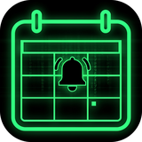
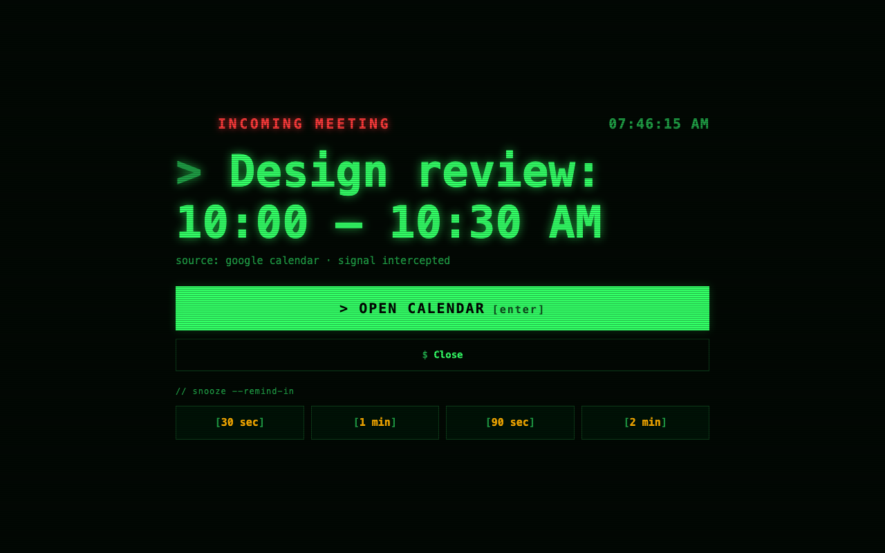
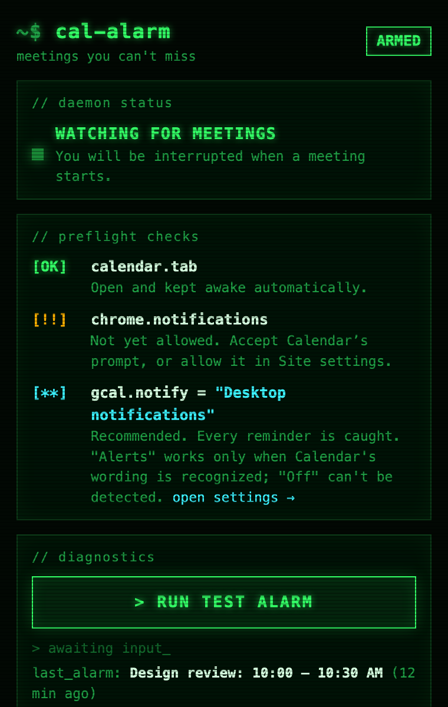
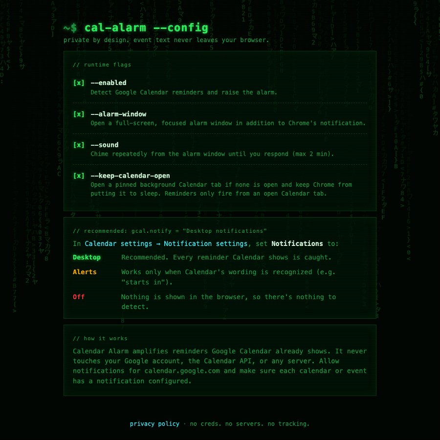

<p align="center">
  
</p>

<h1 align="center">Calendar Alarm</h1>

<p align="center">
  <strong>A Chrome extension that makes Google Calendar meetings impossible to miss.</strong><br>
  No Google login. No API keys. No servers. It just intercepts the reminders Calendar already shows.
</p>

<p align="center">
  <a href="https://github.com/djedi/gcal-meeting-alerter/actions/workflows/ci.yml"></a>
  <a href="LICENSE"></a>
  <a href="manifest.json"></a>
  
  <a href="https://x.com/DustinDavis"></a>
</p>

<p align="center">
  
</p>

## Why

Google Calendar's reminders are easy to miss. They're a small toast in the corner that disappears while you're deep in an editor, a terminal, or a call. Calendar Alarm turns each one into a **full-screen, focused, chiming alarm window** that stays until you respond.

It does this **without your Google credentials**. There's no OAuth, no Calendar API, and no access to your account. It listens for the reminders Google Calendar shows in your browser tab and amplifies them.

## Features

- 🚨 **Full-screen alarm window.** It opens maximized and focused, and chimes every few seconds until you respond (for up to 2 minutes).
- ⌨️ **Keyboard-driven.** <kbd>Enter</kbd> jumps to your Calendar tab and <kbd>Esc</kbd> closes the alarm.
- 😴 **Snooze.** 30 seconds, 1 minute, 90 seconds, or 2 minutes. Snoozes still fire if Chrome suspends the extension in the meantime.
- 📌 **Keeps Calendar open for you.** If no Calendar tab is open, it opens a pinned one in the background, and it stops Chrome's Memory Saver from putting Calendar tabs to sleep.
- ✅ **Setup checklist.** The toolbar popup checks that a Calendar tab is open and that Chrome notifications are allowed, and tells you how to fix either.
- 🔔 **Persistent Chrome notification**, in addition to the alarm window.
- 🟩 **Terminal / Matrix theme**, because it's for developers.
- 🔒 **Private by design.** No analytics, tracking, accounts, remote code, or developer-operated server.

<p align="center">
  
  &nbsp;&nbsp;
  
</p>

## Quick start

Requires Chrome 111 or newer (or another Chromium-based browser).

1. Clone this repository:
   ```sh
   git clone https://github.com/djedi/gcal-meeting-alerter.git
   ```
2. Open `chrome://extensions` and turn on **Developer mode**.
3. Click **Load unpacked** and select the cloned folder.
4. Click the extension's toolbar icon and press **`> RUN TEST ALARM`**. You should get the alarm window.
5. Set up Google Calendar as described below.

### Recommended Google Calendar setting

In [Calendar settings → Notification settings](https://calendar.google.com/calendar/u/0/r/settings), set **Notifications** to **Desktop notifications**.

| Calendar setting | Works? | Why |
| --- | --- | --- |
| **Desktop notifications** | ✅ Recommended | Every reminder Calendar creates is caught. |
| **Alerts** | ⚠️ Partially | Calendar uses the same kind of popup for errors, so only reminders with recognizable wording (such as "starts in") are caught. |
| **Off** | ❌ No | Calendar shows nothing in the browser, so there's nothing to catch. |

Also allow notifications for `calendar.google.com` in Chrome (lock icon → **Site settings** → **Notifications** → **Allow**), and make sure your events have a reminder set. The popup's checklist shows whether notifications are allowed.

## How it works

```
 calendar.google.com tab                          extension service worker
┌─────────────────────────────────────┐          ┌──────────────────────────────┐
│ page-bridge.js  (MAIN world)        │          │ background.js                │
│  • wraps window.Notification        │  post    │  • dedupes signals           │
│  • wraps registration.showNotif…()  ├──────┐   │  • Chrome notification       │
│  • filters window.alert()           │      │   │  • maximized alarm window    │
├─────────────────────────────────────┤      ▼   │  • snoozes via chrome.alarms │
│ content.js  (isolated world)        │  message │  • keeps a Calendar tab open │
│  • watches reminder dialogs         ├─────────►│    and awake (every minute)  │
│  • checks in, reports permission    │          └──────────────┬───────────────┘
└─────────────────────────────────────┘                         ▼
                                                     interrupt.html (alarm window)
```

1. **`page-bridge.js`** runs in the page's own JavaScript context before Calendar's code. It wraps the browser's notification APIs, forwards their text to the extension, and then lets Calendar's own notification show as normal.
2. **`content.js`** watches for Calendar's in-page reminder dialogs and relays everything to the service worker.
3. **`background.js`** removes duplicate signals, then shows the notification and alarm window. It schedules snoozes with `chrome.alarms`, and once a minute it makes sure a Calendar tab is open and protected from being discarded.

### Permissions

| Permission | Used for |
| --- | --- |
| `alarms` | Snoozes and the once-a-minute check that Calendar is open |
| `notifications` | The persistent Chrome notification |
| `storage` | Settings and local reminder state |
| `https://calendar.google.com/*` | Detecting reminders, and finding, opening, or keeping awake the Calendar tab |

It does not request `tabs`, browsing history, or access to any other site.

## Limitations

- **Calendar must be open in Chrome.** The extension only amplifies reminders the Calendar page produces. With **keep Calendar open** enabled (the default), it handles this for you.
- **Chrome must be running.** If Chrome is closed, there's no page to produce reminders.
- **It depends on Google's page behavior.** If Google changes how Calendar shows reminders, detection may need an update. Please [open an issue](https://github.com/djedi/gcal-meeting-alerter/issues/new/choose) if reminders stop coming through.

## Privacy

Reminder text is processed locally and never leaves your browser. There are no analytics, no tracking, no remote code, and no Google account or Calendar API access. Read the full [privacy policy](PRIVACY.md) and [security policy](SECURITY.md).

## Troubleshooting

| Symptom | Fix |
| --- | --- |
| Test alarm works, real reminders don't | Use **Desktop notifications** in Calendar, allow Chrome notifications for Calendar, and check that the event has a reminder. |
| Popup says "Calendar not detected" | Open Calendar, or turn on **keep Calendar open** in settings. After updating the extension, reload the Calendar tab. |
| No sound | Check that **sound** is enabled in settings and that Chrome isn't muted at the OS level. |
| Alarm window doesn't appear | Check that **alarm window** is enabled in settings. The Chrome notification appears either way. |

More in [SUPPORT.md](SUPPORT.md).

## Development

Plain JavaScript with zero runtime dependencies and no build step. Node.js 20+ is only needed for the tooling.

```sh
npm test          # behavior tests (node:test)
npm run check     # syntax checks + full test suite
npm run package   # allowlisted Chrome Web Store ZIP
npm run release   # full quality gate + ZIP
```

After editing source, click **Reload** on the extension card in `chrome://extensions`. Open Calendar tabs reload automatically.

| File | Role |
| --- | --- |
| `page-bridge.js` | MAIN-world hooks for notifications and alerts |
| `content.js` | Reminder-dialog observer and status check-in |
| `alert-core.js` | Shared text normalization, filtering, and dedupe |
| `background.js` | Service worker: alarms, windows, notifications, messaging |
| `calendar-tabs.js` | Focus, open, and keep-awake logic for Calendar tabs |
| `snooze.js` | Snooze scheduling via `chrome.alarms` |
| `interrupt.*` | The alarm window |
| `popup.*` / `options.*` | Toolbar popup and settings page |
| `terminal.css` / `rain.js` | Shared theme and Matrix code rain |

## Feature requests & feedback

I build developer tools like this in the open and post about them on X. If you have a feature idea, find a reminder that slipped through, or just want to say it saved you from missing a meeting, reach out:

- 💡 **[Post a feature request to @DustinDavis](https://x.com/intent/post?text=%40DustinDavis%20feature%20idea%20for%20Calendar%20Alarm%3A%20)**
- 🐦 **[Follow @DustinDavis on X](https://x.com/intent/follow?screen_name=DustinDavis)** for updates and new tools
- 🐛 Bugs with steps to reproduce are best as a [GitHub issue](https://github.com/djedi/gcal-meeting-alerter/issues/new/choose)

If Calendar Alarm is useful to you, a ⭐ on this repo or a post on X helps other people find it.

## Contributing

Contributions are welcome. Read [CONTRIBUTING.md](CONTRIBUTING.md) and the [Code of Conduct](CODE_OF_CONDUCT.md), and report vulnerabilities privately per [SECURITY.md](SECURITY.md). See the [changelog](CHANGELOG.md) for release history.

## License

[MIT](LICENSE) © Dustin Davis ([@DustinDavis](https://x.com/DustinDavis))

Google Calendar is a trademark of Google LLC. Calendar Alarm is an independent project and is not affiliated with or endorsed by Google.
