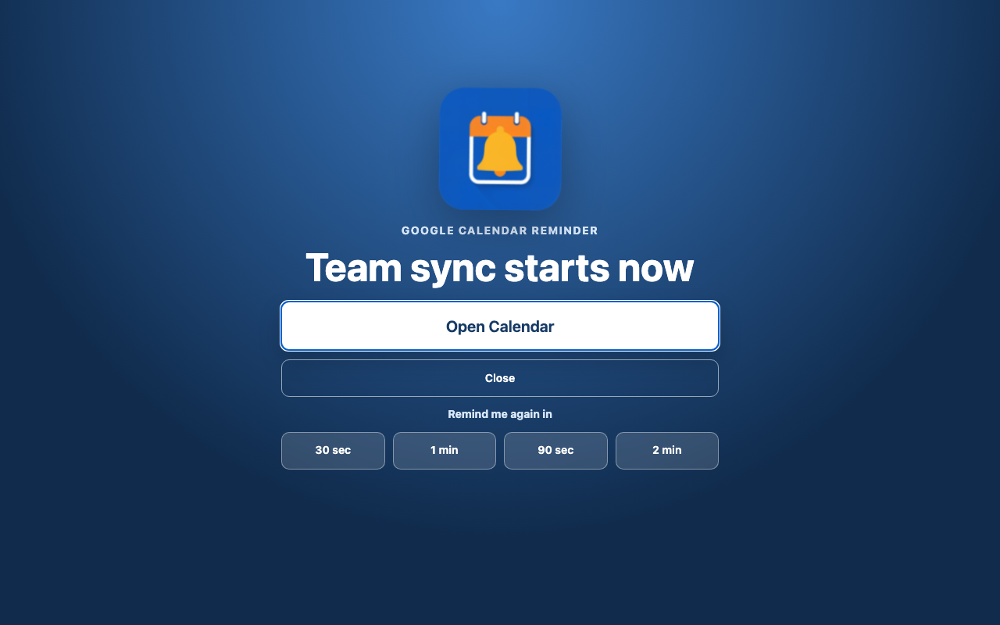

# Calendar Alarm

[](https://github.com/djedi/gcal-meeting-alerter/actions/workflows/ci.yml)
[](LICENSE)
[](manifest.json)

Calendar Alarm makes Google Calendar reminders harder to miss. It watches supported reminder signals from `calendar.google.com`, then requests a high-visibility Chrome notification and—optionally—a focused alarm window with sound.



## Features

- High-visibility Chrome notifications.
- Optional focused 900×600 alarm window with sound.
- Durable 30-second, 1-minute, 90-second, and 2-minute snoozes.
- Open Calendar, close-only, and retry-safe actions.
- Built-in test alarm and configuration screen.
- Minimal permissions and no remote code.
- No analytics, advertising, accounts, subscription, or developer-operated server.

## Important limitation

Calendar Alarm amplifies reminders that Google Calendar surfaces in an open Calendar page. It does not access the Google Calendar API, independently read your calendar, or create reminder schedules. Keep Google Calendar open and configure its own event notifications correctly.

Browser tab freezing and future Google Calendar implementation changes can prevent page-based detection from seeing a reminder. A persistent Chrome notification is requested, but operating systems ultimately control notification presentation.

## Install from source

Requirements: Chrome 111 or newer.

1. Clone or download this repository.
2. Open `chrome://extensions`.
3. Enable **Developer mode**.
4. Select **Load unpacked** and choose the repository directory.
5. Keep Google Calendar open.
6. Open Calendar Alarm from Chrome's toolbar and select **Run test alarm**.

After changing source, select **Reload** on the extension card and refresh any open Calendar tabs.

## How it works

Calendar Alarm uses layered, local-only detection:

1. A Manifest V3 content script watches supported Calendar reminder dialogs.
2. A narrowly filtered MAIN-world bridge observes reminder-like page alerts and page-created notifications while preserving unrelated Calendar behavior.
3. The service worker deduplicates signals and creates the Chrome notification and optional alarm window.
4. `chrome.alarms` provides durable short snoozes even when the service worker suspends.

The extension requests only `alarms`, `notifications`, and `storage`, with host access limited to `https://calendar.google.com/*`.

## Privacy

- Reminder text is processed locally and is never sent to the developer.
- No analytics, tracking, advertising, or external application server.
- No Google account or Calendar API access.
- No browsing-history permission.
- Unrelated alert/notification text is discarded immediately.

Read the complete [privacy policy](PRIVACY.md) and [security policy](SECURITY.md).

## Troubleshooting

If the built-in test works but real reminders do not, verify Google Calendar event notifications, Chrome site notification permission, operating-system Chrome notifications, and that a Calendar tab remains open.

See [SUPPORT.md](SUPPORT.md) for the full checklist and Google's [Calendar notification help](https://support.google.com/calendar/answer/37242).

## Development

Calendar Alarm has no runtime npm dependencies. Node.js 20 or newer is required for development tooling.

```sh
npm test          # behavior tests
npm run check     # syntax checks + complete test suite
npm run package   # allowlisted Chrome Web Store ZIP
npm run release   # full quality gate + ZIP
```

The release command creates `calendar-alarm.zip` containing only runtime files. Chrome Web Store listing copy, artwork, privacy disclosures, and the release checklist live in [`store-assets/`](store-assets/).

## Contributing

Contributions are welcome. Read [CONTRIBUTING.md](CONTRIBUTING.md), follow the [Code of Conduct](CODE_OF_CONDUCT.md), and report vulnerabilities privately according to [SECURITY.md](SECURITY.md).

## License and trademarks

Calendar Alarm is available under the [MIT License](LICENSE).

Google Calendar is a trademark of Google LLC. Calendar Alarm is an independent project and is not affiliated with or endorsed by Google.
